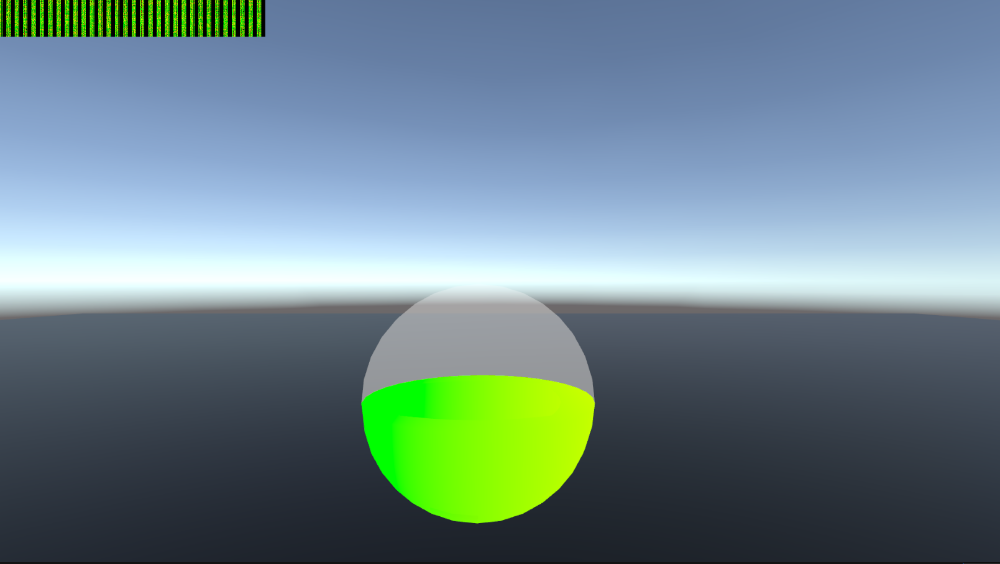

# Screenspace Data Example

Hey gamers here is an example showing a geometry shader encoding multiple per-vertex attributes into a grid of screenspace pixel blocks. This exports the data directly without the need for cameras.

This data is captured into a CRT through the use of a grabpass where a different shader can perform arbitrary computations on said data. 

We then finally read the result of said computations to mesh attributes when actually drawing the mesh.

 #### Credits: 

 Cnlohr for providing helpful example code that really allowed me to understand this.

 MerlinVR for providing code for encoding and decoding perfect 32 bit uints and perfect 32 bit floats.

See these explanations from Pema99 for more information: 
[Encoding and decoding Data in a grabpass](https://github.com/pema99/shader-knowledge/blob/main/tips-and-tricks.md#encoding-and-decoding-data-in-a-grabpass) 
[Easy way to show UV unwrap in clipspace](https://github.com/pema99/shader-knowledge/blob/main/tips-and-tricks.md#easy-way-to-show-uv-unwrap-in-clipspace) 
[Blitting to camera loops or cameras in general](https://github.com/pema99/shader-knowledge/blob/main/geometry-shaders.md#blitting-to-camera-loops-or-cameras-in-general) 
